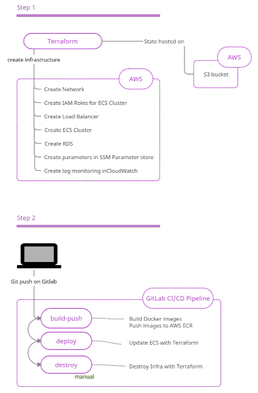
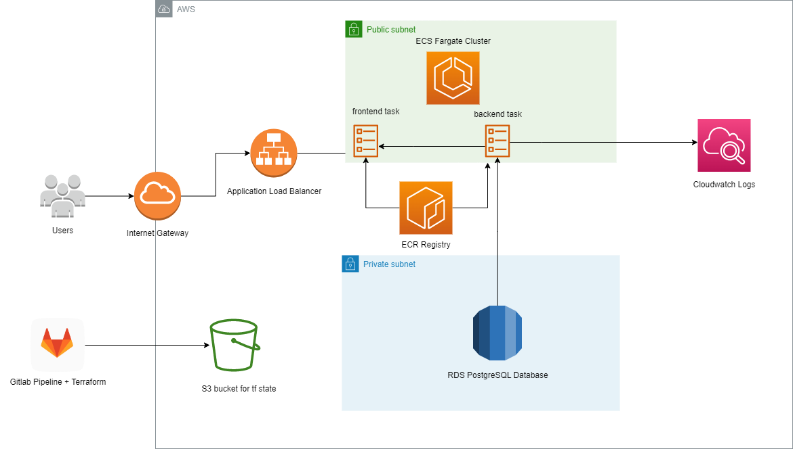

# Final project: GitLab CI/CD + Terraform + AWS ECS Fargate + Docker 

#### A project using Gitlab CI/CD to automatically create and push new Docker images to AWS ECR and deploy them to ECS Fargate. The AWS infrastructure is written using Terraform and is deployed via Gitlab CI/CD.

### Project diagram 

Diagram of the infrastructure created through Terraform:

## Online Shop Application

#### A full-stack Online Shop web application using Spring Boot 2 and Angular 7. 
This is a Single Page Appliaction with client-side rendering. It includes backend and frontend. The frontend client makes API calls to the backend server when it is running.

## Screenshot

#### Credits
The original project author is `zhulinn`.
Repo: https://github.com/zhulinn/SpringBoot-Angular7-Online-Shopping-Store
